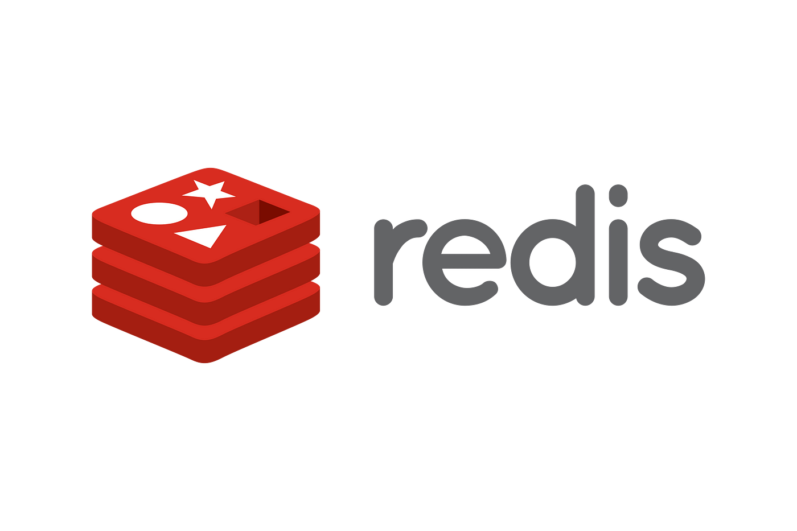

# Redis Basic Project


This project aims to teach basic usage of Redis, an in-memory data structure store, through a series of exercises. You will learn how to perform basic operations such as writing and reading data to and from Redis, using it as a cache, incrementing values, storing lists, and more.

## Getting Started

To get started with this project, follow these steps:

### Prerequisites

- Ubuntu 18.04 LTS
- Python 3.7
- Redis server

### Installing Redis

Install Redis on Ubuntu 18.04 LTS using the following commands:

```bash
$ sudo apt-get -y install redis-server
$ pip3 install redis
$ sed -i "s/bind .*/bind 127.0.0.1/g" /etc/redis/redis.conf
```

## Authors

- [Mouayed sabbagh](https://github.com/MOUAYEDSB)