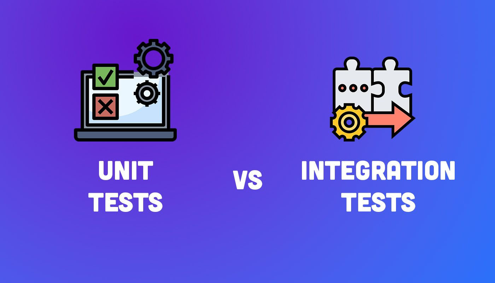

# Unittests and Integration Tests 💻

## Description 💬
Unit Tests and Integration Tests are fundamental components of software development, aimed at ensuring code quality and functionality. Unit Tests focus on verifying the functionality of individual pieces of code in isolation, facilitating early detection of bugs and ensuring each software unit performs as intended. Integration Tests complement this by examining how different units work together, identifying issues in the interaction between these components that may not be evident during unit testing. Together, these testing methodologies enable developers to build more reliable and robust applications by ensuring both the individual parts and the whole system function correctly, ultimately enhancing the software's quality and user experience.

## What we should learn from this project 📑
- The difference between unit and integration tests.
- Common testing patterns such as mocking, parameterizations, and fixtures.

## Tasks 📚
1. Parameterize a unit test
2. Parameterize a unit test
3. Mock HTTP calls
4. Parameterize and patch
5. Parameterize and patch as decorators
6. Mocking a property
7. More patching
8. Parameterize
9. Integration test: fixtures

## Author ✒️

- [Mouayed sabbagh](https://github.com/MOUAYEDSB)

## License 📃
This project is licensed under the MIT License.
