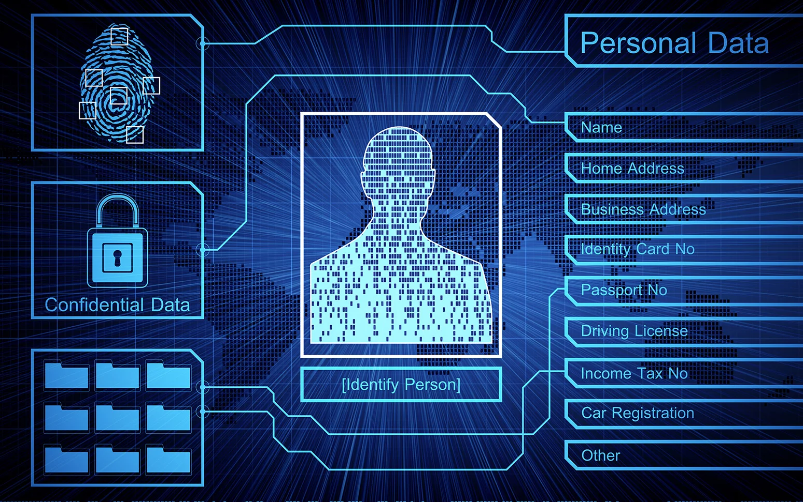

# Personal Data Protection Project

## Description

This project focuses on implementing data protection measures to ensure the security and privacy of personal data. It involves tasks such as obfuscating Personally Identifiable Information (PII), securely logging sensitive data, connecting to databases securely, and encrypting passwords.

## Tasks

1. **Regex-ing:** Implement a function to obfuscate sensitive fields in log messages using regular expressions.
2. **Log formatter:** Update a logging formatter to redact specified fields in log records and display them securely.
3. **Create logger:** Create a logger that logs sensitive data securely, filtering out PII fields and ensuring logs are only kept at the INFO level.
4. **Connect to secure database:** Connect to a secure database using environment variables for credentials, ensuring sensitive data is handled securely.
5. **Read and filter data:** Retrieve data from a database table and display it securely, filtering out sensitive fields in the log messages.
6. **Encrypting passwords:** Implement a function to securely hash passwords using bcrypt for storage in a database.
7. **Check valid password:** Implement a function to validate passwords by comparing them to their hashed counterparts.

## Author ✒️

- [MOUAYED SABBAGH](https://github.com/MOUAYEDSB)

